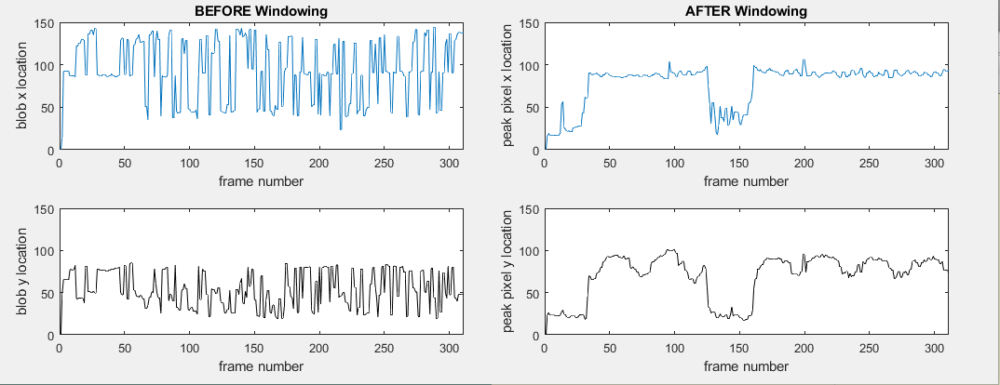

**PCA-Based Object Motion Detection  
and Dimensionality Reduction in MATLAB 
Using Background Subtraction (SVD/PCA) and Clustering **
========================================

by J. Barhydt

*University of Washington, Seattle, WA, 98195*

> **Overview:**

> **Principal Component Analysis (PCA) refers to a mathematical method
> that is used to find correlations among data in an over/under
> determined system subject to constraints via Singular Value
> Decomposition (SVD). Properly implemented, it is a powerful
> application of linear algebra used to extract underlying structure in
> data. PCA has been used in many disparate fields, from neuroscience to
> turbulent flow prediction to market analysis. PCA is more robust than
> SVD towards data sets that scale many orders of magnitude. However,
> along with SVD techniques, the PCA method imposes orthogonality of
> basis solutions, with no constraint on temporal periodicity, in which
> case ICA or DMD methods must be employed, respectively.**

- [Sec.   I. \| Introduction and Overview](#introduction-and-overview)
- [Sec.  II. \| Theoretical Background](#theoretical-background)
- [Sec. III. \| Algorithm Implementation and Development](#algorithm-implementation-and-development)
- [Sec.  IV. \| Computational Results](#computational-results)
- [Sec.   V. \| Summary and Conclusion](#summary-and-conclusions)
- [APPENDIX A\| MATLAB Functions Used](#appendix-a)
- [APPENDIX B\| MATLAB Code](#appendix-b)

# Introduction and Overview
==================================

A group of video clips, taken from three distinct vantage points, were
used to film a paint can oscillating along a rope. Three main trials of
this experimental setup were performed. Trial 1 included only vertical
harmonic motion of the paint can. Trial 2 introduced 'noise' into the
video, including both camera-shake and movement of individuals in the
background. Trial 3 was a repeat of trial 1, except that paint can was
given both oscillation along z and pendulum-like motion along the x-y
axis. Finally Trial 4 introduced rotation of the paint can along its
z-axis, imparting 4 degrees of freedom into the system. A snapshot of
trial 1 from each camera, with the paint can at its lowest point, is
shown in Figure 1 on the next page. The video analysis of each trial was
apportioned into the following two primary sections:

Firstly, foreground-background separation was performed using one of
four methods \-- naive next-frame subtraction, SVD low-rank
reconstruction, PCA orthogonal basis projection, and Robust PCA
deconstruction using the Augmented Lagrange Multiplier (ALM) method.
Once the sparsely-populated 'foreground' frames were collected, a
location algorithm was used to determine the x,y position as a function
of time. The location algorithm used a feature clustering history to
determine a moving 'window' from which a maximal value \--representing
greatest change\-- was located. The resultant position .vs time vectors
were clipped to preserve equal video length and location.

Finally, with all three camera frames converted into x,y coordinates, a
PCA scheme was used to reduce the dimensionality of each trial to
determine the dimension-reduced object location over the entire video.
Comparisons are shown of the performance of each method and
ability/limitations of the PCA method.

{width="5.369792213473316in"
height="1.4371073928258968in"}

> **Figure 1. Snapshot from original video of paint can at its lowest
> point, taken from three vantage points.**

# Theoretical Background
==================================

A feature of the SVD method is that it will decreasingly produce the
most dominant modes underlying the structure of the data, by minimizing
the squared off-diagonal variances. This can be used to create a low
rank approximation of the data, by selecting a subset of these three
matrices. In our analysis, this refers to the 'background' of the image,
as that makes up most of the information in the frame, where the paint
can must be constructed from lower-order modes. To make the analysis
more robust, PCA takes the analysis a step further by subtracting the
mean of each measurement for normalization, and then projecting the
resultant SVD onto the corresponding basis, leaving a sparse matrix
which represents the motion of the paintcan. The normalization also
allows for measurements of varying orders of magnitude, or intensity.
Furthermore, the ALM method is even better at decomposing foreground and
background images, as it builds a matrix sum using a different
constraint, seen below in Equation 1.

> minimize
> [{width="0.9444444444444444in"
> height="0.1527777777777778in"}](about:blank) s.t.
> [{width="0.75in"
> height="0.125in"}](about:blank) (1)

Here L represents the low-rank reconstruction, with the normalization to
each measurements set from PCA and S represents a sparse matrix, our
'foreground'. Lambda is simply an arbitrary scaling coefficient, used to
determine the sparsity of the final solution after several iterations of
the algorithm. Thus smaller values of lambda yield more sparse S
matrices and take more iterations to converge to the constraint. S is
subject to the L1 norm because instead of minimizing the squared
variances, the goal is get be as sparse as possible, i.e. mostly zeros.
In our analysis this is preferred for two reasons. Firstly, the need to
minimize the squared variances leads to a matrix filled with small,
non-zero values, while we only want to capture the motion of the
foreground and not the rest. Secondly, having a sparse matrix is much
faster computationally to perform the location algorithms used in this
analysis. Since most of the calculations are zero, the computer whizzes
through them when doing the location-searching.

The main theme underlying the final analysis of each camera's evaluated
location versus time information lies in the idea of dimensionality
reduction. In this example, three cameras were used for each trial,
giving a total of six dimensions, one corresponding to the x and y
location of each measurement. For trial 1, since the underlying equation
of motion is more-or-less known in this case \--see Equation 2\-- we
would expect there to exist a basis from which there would be only one
dimension to consider, the z-direction.

> [{width="1.0833333333333333in"
> height="0.1527777777777778in"}](about:blank) (2)

Where A is the amplitude of the oscillation, corresponding to the
initial separation from equilibrium, and w is the frequency. If one
wanted to be additionally fancy, a decaying exponential term could be
included to account for energy-loss due to friction, however the basic
motion is the same.

The measurement redundancies become apparent when considering the
covariance matrix of X, shown as Equation 3. This matrix contains
diagonal elements representing the variance of each measurement, along
with off-diagonals corresponding to the relative variance between any
two measurements.

> [{width="0.7916666666666666in"
> height="0.1527777777777778in"}](about:blank) (3)

It is here that the value of SVD comes into play. Performing a SVD of
these data deconstructs the data matrix X into three components, seen
Equation 4. Where U contains the fundamental orthogonal bases, which
from our data represent the underlying structures, in which we would
expect to see a cosine-like structure in the first r columns, where r is
the reduced dimensionality.

> [{width="0.7222222222222222in"
> height="0.1111111111111111in"}](about:blank) (4)

This dimensionality reduction can be seen in the spectrum of sigma,
containing diagonal elements that represent the 'weighting' of each of
those underlying basis structures. Finally, V represents a
transformation matrix, which takes our previous data matrix into a space
such that its covariance matrix becomes diagonal. In our problem, that's
where the magic happens, since the covariance tells us how each mode
relates to one another, and a diagonal covariance matrix mean that we
are representing our data in a basis of statistically independent modes.
In the 1D example above, we expect the systems to collapse into a single
dominant mode.

# Algorithm Implementation and Development
=====================================================

Firstly, the images were scaled down to increase computation time, such
that the operations could be performed quickly on a laptop. The images
were converted into grayscale and each snapshot was organized into
columns of a data matrix. Then, each background subtraction method was
performed to contrast and compare against one another. These different
methods were characterized by a 'mode' parameter in the call to the
vid2loc function, where 'naive', 'clean','noisy' or blank referred to
naive, SVD, ALM PCA, or PCA, respectively.

The naive background subtraction simply subtracted each raw frame from
the following frame. The SVD method first performed an SVD, then a
low-rank reconstruction is subtracted from the original data, leaving
the sparse L2 foreground. The PCA method normalized each row of data and
then projected the data matrix onto the SVD u basis, giving the
underlying structure of each frame. Finally, the ALM PCA simply made a
call to the pre-made inexact\_ALM\_rPCA function found at
[[http://perception.csl.illinois.edu/matrix-rank/Files/inexact\_alm\_rpca.zip]{.underline}](http://perception.csl.illinois.edu/matrix-rank/Files/inexact_alm_rpca.zip).

Following background subtraction, several techniques -found in the
locator function- were used to determine the x,y coordinates of the
paint can for each frame. The most robust version will be explained
here, and corresponds to the 'noisy' call of vid2pos. Firstly, the video
is separated into several slices. Then, all frames within the slice are
individually run through a 'blob detector' that first filters all values
in the frame above a threshold, then assigns the remaining points a
value of 1, making a binary map of the image. Then, the function
analyzes the area of these remaining 'blobs' and returns the position of
the 'blob' with the most area. Often this blob is the paintcan, but not
always. Therefore, the compilation of 'blob' locations is averaged
across the entire slice and fed back into the locator in 'point' mode,
along with the x and y averaged 'blob' location. While in 'point' mode,
the locator first uses the averaged blob location to create a small
window from which to search for a peak, which comes from the very
intense flashlight atop the paintcan. The maximal value within this
window is found and returned by the locator function. The subsequent
locator function call then uses this updated location as an input to
determine a new window location. In effect, the window 'follows' the
measured location of the paint can over time. Moreover, a new averaged
location is prepared after each slice is complete, to prevent the window
from drifting too far from the paint can, where it would be unable to
locate it. A vector of x and y locations for that video are returned
from the vid2pos function.

Then, to evaluate the locations, each location dataset is
'phase-shifted' so that their periods match. This is simply done by
subtracting the resultant vectors until a minimum is found near the
beginning of the video. The position vectors are then truncated, so that
they are equal in length and have roughly the same start and end point.
Next, a matrix is constructed by stacking all of the location
information and PCA is performed on the data. The spectrum is observed
for each reduction to compare dimensionality of the new basis and the
dominant modes are extracted.

# Computational Results
=================================

There were three parts to the computational results, shown below when
used on the noisy data set, again as this is the most challenging to
decipher so it was used as a baseline of comparison between methods.

Background Subtraction Comparison
---------------------------------

Plotting the results of various background/foreground discrimination
techniques shows the overall difficulty that any technique has towards
extracting location information from noisy scenes. The naive background
subtraction definitely performs the worst, leaving almost no usable data
in the end. The SVD and PCA methods both performs similarly, which is
not too surprising, considering the one difference is in the
normalization process. Any given image has pixel values ranging from 1
to 255, so there is scaling consistency across all frames and pixels.
Though the images appear fairly similar visually, the underlying
numerical values vary quite a bit, especially in PCA where much of the
values are already at or near 0. One main difference that is visually
noticeable is the 'smear' that SVD produces around the paint can. This
comes from the fact that a low-rank reconstruction is going to be the
strongest mode of the whole video, or in a sense the 'average' frame. It
would be like increasing the camera's exposure time. The largest failure
in the SVD algorithm is caused by this 'smear' since the windowing
algorithm seemed to 'latch' onto the corner of the smear for a dozen
frames or so, before finding the paint can again; this shows up in the
position plot as a 20 frame 'lull' in the data. These results are shown
below in Figure 2, where the blue graph is a plot of x versus time, and
the black plot is y versus time, and the 'masks' are the underlying
image blobs. Overall, the standard PCA seems to do the best generically.
I did notice that ALM can be pretty sensitive to 'tweaking' the lambda
coefficient, such that it is possible to get very nice data out, if you
massage it properly. It's easy to see where ALM fails at the generic
lambda, since the background mask is *very* sparse.

Blob to Moving Window Peaks
---------------------------

Figure 3 shows a comparison between the same two data sets, where the
'blob' only location-finder is on the left and the averaged moving
window with peak location is shown on the right. It is very clear that
maintaining a narrow window to search for the paint can helped reduce
noise considerably, though the window did quickly shift downward for
about ten frames in the middle. A tighter slice would help reduce this
type of issue, though with noisy data solving one problem often creates
another. Looking at the other background subtractions in Figure 3 shows
that some methods \--SVD, rPCA\-- fail in this time-frame, and the video
shows a great deal of noise here, such that it's difficult to resolve
the paint can even with the naked eye. To illustrate this, figure 4
shows an SVD background at frame 150, can *you* find the can? Sorta, but
our brains are clearly super robust at performing PCA!

{width="4.645833333333333in"
height="7.625in"}

**Figure 2. Background subtraction to paint can location comparison with
background mask shown on left and x, y coordinate results shown on
right.**

{width="5.807292213473316in"
height="2.2350754593175854in"}

**Figure 3. Result of blob to average moving window performance in noisy
data for position extraction.**

{width="2.057292213473316in"
height="1.5788517060367455in"}

**Figure 4. Still background SVD subtraction image at frame \#150.**

{width="4.369792213473316in"
height="3.288246937882765in"}

**Figure 5. Trial 1 Reduced-dimension oscillation behavior (below)
showing one dominant mode (above).**

{width="2.498413167104112in"
height="1.953125546806649in"}{width="3.213542213473316in"
height="2.479903762029746in"}

**Figure 6.Comparison between raw location information (left) and PCA
modes (right) of Trial 2.**

{width="2.4536023622047245in"
height="2.2656255468066493in"}{width="3.25in"
height="2.4426104549431322in"}

**Figure 7.Comparison between raw location information (left) and PCA
modes (right) of Trial 3.**

{width="2.3687849956255467in"
height="1.7864588801399826in"}{width="3.338020559930009in"
height="2.5677088801399823in"}

**Figure 8.Comparison between raw location information (left) and PCA
modes (right) of Trial 4.**

Dimensionality Reduction (Trials 1-4)
-------------------------------------

The following settings were used to capture the graphs above:

Trial 1: mode='clean' lambda=0.005

> Trial 2:mode='noisy' lambda=0.005
>
> Trial 3:mode='noisy' x1 lambda=0.005, x2 lambda=0.01, x3 lambda=0.01
>
> Trial 4:mode='noisy' lambda=0.005

Figure 5, which used trial 1 in the 'clean' mode of vid2pos show a clear
1-dimensional behavior, with a very tiny oscillation along a second
axis. The other 3 trials were not nearly so easy to resolve. The noise
in Trial 2 clearly made dimensionality reduction a mess. Even though the
qualitative position graphs on the left look pretty decent, PCA doesn't
care about oscillations in time and merely spits out some modes that
work. I'm guessing DMD would perform much better for this analysis. Due
to the windowing algorithm difficulty in tracking objects diagonally,
Trial 3 was very difficult and required fine tuning of lambda for each
coordinate pair. Overall, the result was poor and the third mode was
almost pure noise, shown in figure 7. Trial 4 was very clean, except
that the windowing calculation has a hard time following the can until
about halfway through the video. Performing the vector clipping multiple
times cleaned up the graphs, while throwing away some data. Ultimately,
it still performed quite well, as seen in figure 8. The third mode is
small, about 1%, and is shown in yellow, you can see that it is chopped
up pretty badly. Still, there were no modes beyond that which were not
numerical round-of, hence they analysis did indeed predict a 3 dimension
solution. Unfortunately, due to the cylindrical symmetry of the paint
can, rotation along z was not captured at all, although with further
refinement to locate the flashlight on top of the can, plus another
camera angle (not available in this set) I think it would be possible to
tease it out.

# Summary and Conclusions
==================================

SVD, including various forms of PCA, is a powerful tool for
dimensionality reduction in big data sets. Though the methods were able
to qualitatively find underlying oscillation modes, often the nature of
SVD becomes a hindrance. Using the robust PCA method to build a sparse
matrix, subject to the L1 norm improved tracking ability greatly,
although it requires customization of each data run. In practice, this
could be problematic, as large videos can take quite long to deconstruct
using this method. In still-frame cameras, with simple motion, the
technique works incredibly well, even using SVD alone, without any
robust statistics to clean up the data. Also, the orthogonality
requirement of SVD seems to disallow motion in more than two orthogonal
directions, in the same sense it would not be able to capture
non-orthogonal modes. Furthermore, the indifference to periodicity
leaves some functions quite messy in the reconstruction, despite them
being rather smooth inputs. Finally, the blob recognition and windowing
produces very clean data, though it has a tendency to drift, in which it
remains out-of-view of the can for many frames, sometimes indefinitely.
A dynamic window scale could help to prevent this, along with predictive
windowing, especially for videos with diagonal or rapid movement.

# APPENDIX A 
(MATLAB Functions Used / Description With Example)
=============================================================

APPENDIX A (MATLAB Functions Used / Description With Example)
=============================================================

function \[x,y\] = vid2pos(A,mode,slices,lambda,fail)

\%This program takes in a matrix of video frames and attempts to find

\%the location of a single moving object as it moves from frame to frame

\%

\%There are four \'modes\' to compare performance of different
techniques

\%including: mode string

\% \-\-\-\-\-\-\-\-\-\-\-\-\-\-\-\-\-\-\-\-\-\-\-\-\-\-\-\-\-\-\-\-\-\--

\% Naive BG subtraction \'naive\'

\% SVD low-rank subtraction \'clean\'

\% Robust ALM PCA Sparse BG \'noisy\'

\% PCA Image Projection DEFAULT

\%

\% Additionally, there are two parameters, slices and lambda

\% slices: accepts an integer number to slice the video into segments

\% lambda: accepts a value\<1 indicating sparsity of rPCA method

\% see the following website/file:

\%http://perception.csl.illinois.edu/matrix-rank/Files/inexact\_alm\_rpca.zip

\% fail: back-up mode if windowing is ineffective, set to \'yes\' or
blank

\%default arguments

if nargin \< 2

mode = \'clean\';

end

if nargin \< 3

slices = 2;

end

if nargin \< 4

lambda = 0.05;

end

if nargin \< 5

fail=\'\';

end

\% initialization variables

num\_frames=size(A,3);

im\_h=size(A,1);

im\_w=size(A,2);

clip\_length = uint32( num\_frames/slices);

x=zeros(num\_frames,1);

y=zeros(num\_frames,1);

\%construct images into stacked matrix, each column is one frame

for i=1:num\_frames

X(:,i) = reshape( A(:,:,i), im\_w\*im\_h, 1);

end

\%Below are the operation \'modes\'

\%Robust PCA via Augmented Lagrange Multiplier

if isequal(mode,\'noisy\')

\[\~,S\]=inexact\_alm\_rpca(X,lambda);

\%SVD Low-Rank Approxmiation

elseif isequal(mode,\'clean\')

\[u,s,v\]=svd(X,\'econ\');

q=10;

L=u(:,1:q)\*s(1:q,1:q)\*v(:,1:q).\';

S=X-L;

\%Simple Background Frame Subtraction

elseif isequal(mode,\'naive\')

S=X(:,1:end-1)-X(:,2:end);

num\_frames=num\_frames-1;

\%Standard PCA method

else

\[m,n\]=size(X);

nuclear\_norm=mean(X,2);

Xr=X-repmat(nuclear\_norm,1,n);

\[u,s,v\]=svd(Xr\'/sqrt(n-1),\'econ\');

Y=Xr\*u\';L=u(:,1:3)\*s(1:3,1:3)\*v(:,1:3).\';

for i=1:num\_frames

\[x(i+1),y(i+1)\]=locator(reshape(Y(:,i),im\_h,im\_w),\'point\',\[x(i),
y(i)\]);

end

return

end

\%Run in simple,clean mode if windowing fails

if isequal(fail,\'yes\')

for i=1:num\_frames

frame=reshape(S(:,i),im\_h,im\_w);

frame=frame.\*frame;

\[x(i),y(i)\]=locator(frame.\*(frame\>0));

end

return

end

\% determine iterations for various slice sizes

for j=1:slices

if j==slices&&slices\>1

if mod(num\_frames,clip\_length)==0

iters=clip\_length;

else

iters=mod(num\_frames,clip\_length);

end

else

iters=clip\_length;

end

\%Initialize training values for window location

x\_train = \[\];

y\_train = \[\];

for i=1:iters

k=(j-1)\*clip\_length+i;

\[x\_train(i),y\_train(i)\]=locator(reshape(S(:,k),im\_h,im\_w));

end

\%Remove null entries and take training set mean location

x\_train(x\_train==0) = \[\];

y\_train(y\_train==0) = \[\];

x(k)=mean(x\_train);y(k)= mean(y\_train);

\%Run locator in \'point\' mode, performing moving-window capability

for i=1:iters

k=(j-1)\*clip\_length+i;

\[x(k+1),y(k+1)\]=locator(reshape(S(:,k),im\_h,im\_w),\'point\',\[x(k),
y(k)\]);

end

end

function \[x, y, blobs\] = locator(X, type, guess, win\_size,
max\_iters)

\%This function accepts an image in matrix format and performs analysis

\%to determine the location of an object in the image

\% Arguments:

\%\-\-\-\-\-\-\-\-\-\-\-\-\-\-\-\-\-\-\-\-\-\-\-\-\-\-\-\--

\% X: the n by m image matrix

\% type: perform cluster location using \'clust\' keyword or by default,

\% or use frame windowing to find peak value within a window.

\% win\_size: a fraction representing the size of the window relative to

\% image.

\% max\_iters: currently defunct, but in development to use kmeans
method

\% for cluster location. replaced by regionprops(), which

\% discounts background as a potential cluster.

\% default arguments

if nargin \< 2

type = \'clust\';

end

if nargin \< 3

guess = \[0 0\];

end

if nargin \< 4

win\_size = 0.1;

end

if nargin \< 5

max\_iters = 30;

end

\% initialization

x\_old = \[10 10\];

x\_new = \[guess(1) guess(2)\];

blobs=0;

if isequal(type,\'clust\')

\% sets background threshold level

filter = graythresh(X);

if filter==0

x = x\_new(1);

y = x\_new(2);

return;

end

\% binary map of points above threshold

bin = abs(X)\>filter;

\% calculates size/location of each cluster in image

s = regionprops(bin,\'Area\',\'Centroid\');

\[\~,ind\]=max(\[s.Area\]);

locs=s(ind).Centroid;

x = locs(1);

y = locs(2);

return;

end

if isequal(type,\'point\')

\% pads the image and sets up window

buffer\_size = 100; %generically, larger pads can be used.

\%round(8\*max(\[win\_size\*size(X,1),win\_size\*size(X,2)\]));

X = padarray(X,\[buffer\_size buffer\_size\],0,\'both\');

win\_h=round(win\_size\*size(X,1));

win\_w=round(win\_size\*size(X,2));

x=round(guess(1))+buffer\_size;

y=round(guess(2))+buffer\_size;

window = X((y-win\_h):(y+win\_h),(x-win\_w):(x+win\_w));

\%sets threshold for binary map inside window

filter = graythresh(window);

if filter==0

x = x\_new(1);

y = x\_new(2);

return;

end

bin = window\>filter;

s = regionprops(bin,\'Area\',\'Centroid\');

\[blobs,ind\]=max(\[s.Area\]);

locs=s(ind).Centroid;

x = x-win\_w+locs(1)-100;

y = y-win\_h+locs(2)-100;

end

\% FUTURE DEVELOPMENT:

\% for i=1:max\_iters

\% % tolerance check

\% dist = norm(x\_old-x\_new);

\% if dist\<tol

\% x\_loc = x\_new(2);

\% y\_loc = x\_new(1);

\% return;

\% end

\% x\_old=x\_new;

\% x1\_bin = kmeans(X,2)-1;

\% x\_new(1) = sum( (1:size(x1\_bin)).\*x1\_bin\') / sum(x1\_bin);

\% x2\_bin = kmeans(X\',2)-1;

\% x\_new(2) = sum( (1:size(x2\_bin)).\*x2\_bin\')/ sum(x2\_bin);

\%

\% % \[\~,C\]=kmeans(X,2);

\% % x\_new(1) = C(1);

\% % \[\~,C\]=kmeans(X\',2);

\% % x\_new(2) = C(1);

\% %hist(:,i) = x\_new;

\% %iters=i;

\% end

\% \[\~,z\]= imregionalmax(X);

\% \[\~,w\]= imregionalmax(X);

\% a=z;b=w;

\%

\% x\_loc = (4\*x\_new(2)+0\*guess(2))/4;

\% y\_loc = (4\*x\_new(1)+0\*guess(1))/4;

end

# APPENDIX B 
(MATLAB Code)
========================

\% PCA Motion-Capture

\% Johnathon R Barhydt

clear all, close all, clc

\%initialization variables

mode=\'\';

a = 1/4;

N=2; %video set

lambda=0.005;

\%pick and name video set

c1=strcat(\'cam1\_\',num2str(N),\'.mat\');

c2=strcat(\'cam2\_\',num2str(N),\'.mat\');

c3=strcat(\'cam3\_\',num2str(N),\'.mat\');

\% get camera data

cam1 = importdata(c1);

cam2 = importdata(c2);

cam3 = importdata(c3);

\%num\_frames = min(\[size(cam1,4),size(cam2,4),size(cam3,4)\]);

num\_frames1= size(cam1,4);

num\_frames2= size(cam2,4);

num\_frames3= size(cam3,4);

\%image size

im\_h=uint32( size( cam1,1)\*a);

im\_w=uint32( size( cam1,2)\*a);

\%initialize frames

X1\_images = zeros(im\_h,im\_w, num\_frames1);

X2\_images = zeros(im\_h,im\_w, num\_frames2);

X3\_images = zeros(im\_h,im\_w, num\_frames3);

\%populate frames

for i=1:num\_frames1

X1\_images(:,:,i) = im2double( imresize(rgb2gray( cam1(:,:,:,i)),\[im\_h
im\_w\]));

end

for i=1:num\_frames2

X2\_images(:,:,i) = im2double( imresize(rgb2gray( cam2(:,:,:,i)),\[im\_h
im\_w\]));

end

for i=1:num\_frames3

X3\_images(:,:,i) = im2double( imresize(rgb2gray( cam3(:,:,:,i)),\[im\_h
im\_w\]));

end

\%% Run each video through vid2pos to collect x, y coordinates

\[x1,y1\]=vid2pos(X1\_images,\'noisy\',20,lambda);

\[x2,y2\]=vid2pos(X2\_images,\'noisy\',20,lambda);

\[x3,y3\]=vid2pos(X3\_images,\'noisy\',20,lambda);

\%% Crop and shift coords to same timebase

x1(1:20)=\[\];

x2(1:20)=\[\];

x3(1:20)=\[\];

y1(1:20)=\[\];

y2(1:20)=\[\];

y3(1:20)=\[\];

if var(x1)\>var(y1)

\[\~,ind\]=max(x1(1:30));

else

\[\~,ind\]=max(y1(1:30));

end

x1(1:ind)=\[\];

y1(1:ind)=\[\];

if var(x2)\>var(y2)

\[\~,ind\]=max(x2(1:30));

else

\[\~,ind\]=max(y2(1:30));

end

x2(1:ind)=\[\];

y2(1:ind)=\[\];

if var(x3)\>var(y3)

\[\~,ind\]=max(x3(1:30));

else

\[\~,ind\]=max(y3(1:30));

end

x3(1:ind)=\[\];

y3(1:ind)=\[\];

trunc = min(\[size(x1,1),size(x2,1),size(x3,1)\]);

x1(trunc:end)=\[\];

x2(trunc:end)=\[\];

x3(trunc:end)=\[\];

y1(trunc:end)=\[\];

y2(trunc:end)=\[\];

y3(trunc:end)=\[\];

\%%

X=\[x1,y2,x2,y2,x3,y3\];

\[L,S\]=inexact\_alm\_rpca(X);

X=L;

\[m,n\]=size(X);

nuclear\_norm=mean(X,2);

X=X-repmat(nuclear\_norm,1,n);

\[u,s,v\]=svd(X\'/sqrt(n-1),\'econ\');

lambda=diag(s).\^2;

l\_norm = lambda/sum(lambda);

figure(1)

subplot(2,1,1)

bar(l\_norm), title(\'Principle Component Strength - Trial 2\'),
xlabel(\'mode\'),ylabel(\'strength in %\')

subplot(2,1,2)

plot(v(:,1)), hold on, plot(v(:,2)), hold on, plot(v(:,3)),
xlabel(\'time (frame\#)\'),ylabel(\'position (rel)\')

legend(\'primary mode\',\'secondary mode\',\'tertiary mode\')

\%%

figure(1)

title(\'Quantitative Comparison\')

subplot(6,1,1)

plot(x1), axis off

subplot(6,1,2)

plot(y1), axis off

subplot(6,1,3)

plot(x2), axis off

subplot(6,1,4)

plot(y2), axis off

subplot(6,1,5)

plot(x3), axis off

subplot(6,1,6)

plot(y3), axis off
